<h1> Hey! Nice to see you.</h1>

### Welcome to my github profile  

	

- 🔭 I’m currently working on [Code-Mars](https://code-mars.netlify.app/)

- 👯 I’m looking to collaborate on **Web Development Project**

- 📫 How to reach me **LinkedIn**

## 🌐 Socials:
  

# 💻 Tech Stack:

    

&nbsp;

